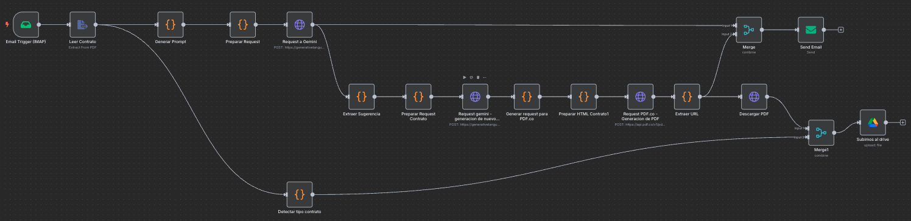
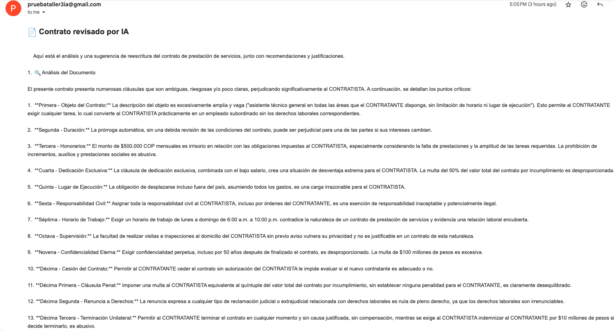
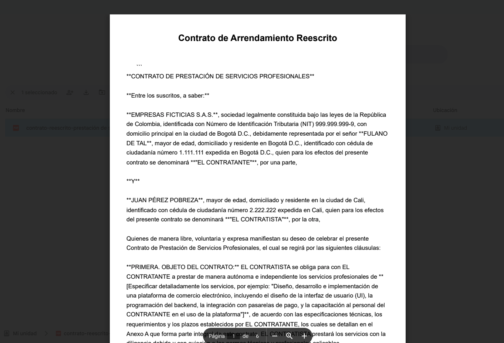

# 🤖 Automatización Inteligente de Revisión y Reescritura de Contratos

Este proyecto corresponde al desarrollo del **Taller Final – Técnicas Avanzadas de IA Aplicadas en Modelos de Lenguaje**. Consiste en la construcción de un sistema automático que:

1. Recibe contratos por correo.
2. Extrae su contenido.
3. Analiza el contrato con un modelo de lenguaje (Gemini).
4. Sugiere mejoras legales.
5. Reescribe el contrato automáticamente.
6. Genera un nuevo PDF.
7. Envía un correo con las sugerencias y el nuevo contrato.
8. Guarda automáticamente el contrato en Google Drive.

---

## 📸 Referencias Visuales

### 🧠 Flujo completo del sistema



### 📩 Correo con recomendaciones



---

## ⚙️ Tecnologías usadas

- [n8n](https://n8n.io/) como motor de automatización de flujos.
- API de [Gemini](https://ai.google.dev/gemini-api) para reescritura con IA.
- [PDF.co](https://pdf.co/) para generación de PDF desde HTML.
- [Google Drive API](https://developers.google.com/drive) para almacenamiento.
- [IMAP Trigger](https://docs.n8n.io/integrations/builtin/nodes/N8n-nodes-base.emailReadImap/) para monitoreo de correos.

---

## 🔁 Flujo paso a paso

A continuación se explica el funcionamiento del sistema:

### 1. 📥 Email Trigger (IMAP)
Activa el flujo automáticamente cuando llega un nuevo correo con archivo PDF adjunto.

### 2. 📄 Leer Contrato (Extract PDF)
Extrae el texto del contrato en PDF recibido para su análisis.

### 3. ✍️ Generar Prompt
Crea el mensaje que se le enviará al modelo de lenguaje. Por ejemplo:  
_"Analiza el siguiente contrato y sugiere mejoras legales..."_

### 4. 🤖 Request a Gemini
Envía el contrato al modelo de IA (Gemini) y recibe sugerencias legales detalladas.

### 5. 🧠 Extraer Sugerencia
Filtra y prepara el texto generado por Gemini.

### 6. 📦 Preparar nueva solicitud
Se construye un nuevo prompt para que la IA reescriba el contrato con base en las sugerencias.

### 7. 🧠 Reescritura por IA
Gemini genera la nueva versión del contrato, ya con mejoras aplicadas automáticamente.

### 8. 🖥️ Preparar HTML
Convierte el contrato reescrito a formato HTML.

### 9. 📄 Generar PDF con PDF.co
Genera el nuevo PDF listo para compartir y almacenar.

### 10. 🔗 Extraer URL
Extrae el link temporal del PDF generado desde PDF.co.

### 11. 📥 Descargar PDF
Usa un `HTTP Request` para descargar el archivo PDF como binario.

### 12. 🧾 Detectar tipo de contrato
Analiza el contenido para clasificar el contrato: laboral, arrendamiento, prestación de servicios, etc.

### 13. ☁️ Subimos al drive
Carga el archivo PDF en Google Drive, con nombre que incluye el tipo de contrato y la fecha.  
Ejemplo:  
`contrato-reescrito-laboral-2025-06-06_12-15.pdf`


### 14. 📤 Enviar correo
Se envía un email automático al remitente original con:

- Las recomendaciones sugeridas por IA.
- Un link al nuevo contrato en PDF.

---

## 📂 Estructura del repositorio

```bash
Taller_3_Atomatizacion_contratos/
├── README.md
├── flujo.n8n.json               # Exportación del flujo desde n8n
├── referencias/                 # Imágenes usadas en el README
│   ├── flujo.png
`   └── correo_de_ejemplo.png
    └── Plantilla_generada.png
